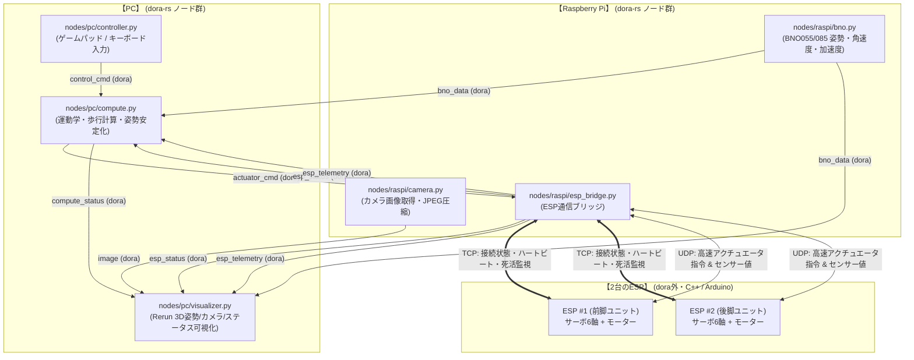

# QuadKen Dora v2 (PC - Raspberry Pi - Dual ESP)

**dora-rs** をベースにした、4脚ロボット「QuadKen」の分散制御アーキテクチャです。
PC、Raspberry Pi、および2台のESP32間を高速・堅牢に連携します。

---

## 1. システム構成図



---

## 2. フォルダ構成

ノードはご指定通り `pc` と `raspi` に分離して配置されています。

```
QuadKen_dora_v2/
├── pyproject.toml              # uvで完全管理される依存パッケージ定義
├── uv.lock
├── README.md                   # 本ドキュメント
├── dataflow.yml                # 分散実行用データフロー (PC + Raspberry Pi)
├── dataflow_local.yml          # ローカル開発・テスト用データフロー (PC単体動作)
├── cluster.yml                 # dora-rs クラスタ設定 (各マシンのIP・ユーザー定義)
├── config/
│   └── robot_config.py         # ポート番号・IPアドレス・通信設定
├── nodes/
│   ├── pc/                     # PC側ノード
│   │   ├── controller.py       # ゲームパッド/キーボード操作 (pygame)
│   │   ├── compute.py          # 逆運動学・歩行生成・フェイルセーフ判定
│   │   └── visualizer.py       # Rerunによるリアルタイム可視化
│   └── raspi/                  # Raspberry Pi側ノード
│       ├── camera.py           # カメラ取得 (実機/モック自動切替)
│       ├── bno.py              # BNO055/085 IMU取得 (実機/モック自動切替)
│       └── esp_bridge.py       # 2台のESPとのTCP接続監視 & UDPセンサー/指令送受信
├── esp/
│   ├── esp_simulator.py        # PC上で実機なしでテストできるESP1/ESP2シミュレータ
│   └── esp_firmware_sample/    # ESP32用サンプルファームウェア
│       └── esp_firmware_sample.ino
└── scripts/
    ├── run_local.ps1           # Windows用ローカル一括実行スクリプト
    ├── run_local.sh            # Linux/Mac用ローカル一括実行スクリプト
    ├── run_distributed_pc.ps1  # PC側分散コーディネーター起動
    └── run_distributed_raspi.sh# ラズパイ側デーモン起動
```

---

## 3. 通信プロトコルの切り分け

### (1) PC ⇄ Raspberry Pi (dora-rs)
- **dora-rs** がノード間パイプラインをオーケストレーション。
- 高速データプレーン（Zenoh共有メモリ / ネットワーク）により、カメラ映像（JPEG）や高頻度BNOデータを超低遅延で通信。

### (2) Raspberry Pi ⇄ 2台のESP (TCP + UDP)
- **TCP (接続状態・死活監視・フェイルセーフ)**:
  - ポート: ESP1=`5001`, ESP2=`5002`
  - ラズパイから 500ms ごとにハートビート（PING）を送信。
  - ESPからの PONG 応答により、**接続中(CONNECTED) / 切断(DISCONNECTED) / 遅延(RTT ms)** を常に把握。
  - 切断やタイムアウト（1秒以上無応答）を検知すると、即座に dora 経由で PC の `compute` ノードへ通知し、フェイルセーフ（安全停止）を発動。
- **UDP (高頻度センサー値 & アクチュエータ指令)**:
  - ポート: ESP1=`6001`, ESP2=`6002`, ラズパイ受信=`6000`
  - **ESP → ラズパイ (センサー値)**: 電流、電圧、エンコーダ値、足先接地センサなどを 50Hz でノンブロッキング送信。
  - **ラズパイ → ESP (アクチュエータ指令)**: PCで計算された各サーボの目標角度やモーターPWM値を 50Hz で送信。

---

## 4. 可視化 (dora-rerun) & トレース (dora-tracing)

### Rerun による可視化
`nodes/pc/visualizer.py` が自動的に **Rerun Viewer** を起動し、以下の情報をリアルタイム描画します：
- **Camera (2D)**: カメラ映像（実機接続時はカメラ画像、未接続時はテストHUD映像）
- **Robot 3D Pose**: BNOセンサーのクォータニオンによるロボットベースの3D姿勢トランスフォーム
- **IMU Plots**: Roll / Pitch / Yaw、ジャイロ角速度、加速度のタイムシリーズグラフ
- **ESP Health (TCP)**: ESP1 / ESP2 の接続フラグ、通信レイテンシ(ms)、ステータステキスト
- **Control**: 並進・旋回速度司令 (`vx`, `vy`, `vyaw`)、歩行モード、E-Stop状態

### dora-tracing によるプロファイリング
`dora-rs` のトレース機能を使ってノード間の通信遅延や処理時間をプロファイリングできます：
```powershell
# 直近のトレース一覧を確認
uv run dora trace list

# 特定トレースのスパン詳細を表示
uv run dora trace view <TRACE_ID>
```

---

## 5. 動かし方

すべて `uv` のみで実行可能です（Rustやcargoのインストールは不要です）。

### A. PCローカルでの動作確認（実機がなくてもすぐテスト可能）

ESPシミュレータと全ノードをPC上でまとめて動かせます。Git Bash から以下を実行します：

```bash
# 1. 依存関係の同期 (初回のみ)
uv sync

# 2. ローカル実行 (Git Bash)
./scripts/run_local.sh
```

※ 手動で別ターミナルから起動する場合：
```bash
# ターミナル1: ESP1 & ESP2 シミュレータの起動
uv run python esp/esp_simulator.py

# ターミナル2: ローカルデータフローの実行 (Rerunが自動起動します)
uv run dora run dataflow_local.yml --uv
```

### B. 実機分散運用（PC + Raspberry Pi）

#### 1. Raspberry Pi 側の準備
Raspberry Pi 上で本リポジトリを取得し、環境を同期してデーモンを起動します：
```bash
# ラズパイ側で実行
uv sync

# PCのIPアドレスを指定してデーモンを起動
./scripts/run_distributed_raspi.sh 192.168.1.50
```

#### 2. PC 側の起動 (Git Bash)
PC の Git Bash で以下を実行します：
```bash
# コーディネーター起動
./scripts/run_distributed_pc.sh

# 分散データフローを開始
uv run dora start dataflow.yml --name quadken
```

#### 3. ESP32 側の書き込み
`esp/esp_firmware_sample/esp_firmware_sample.ino` を Arduino IDE で開き：
1. `WIFI_SSID` / `WIFI_PASSWORD` を設定
2. ESP1側は `#define ESP_ID_NUMBER 1`、ESP2側は `#define ESP_ID_NUMBER 2` として書き込み
3. 電源を入れると Wi-Fi に接続し、ラズパイからの接続を待機します。
