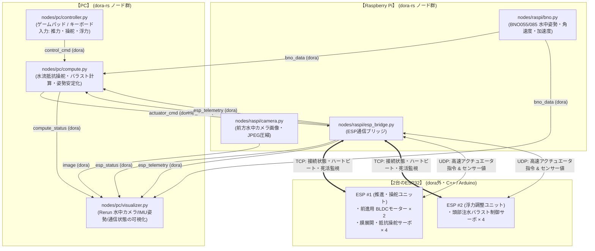

# QuadKen Dora v2 (円筒型水中ロボット / AUV)

**dora-rs** をベースにした、円筒型水中ロボット「QuadKen」の分散制御アーキテクチャです。  
PC、Raspberry Pi、および2台のESP32間を高速・堅牢に連携し、推進・水流抵抗操舵・浮力調整をリアルタイムに制御します。

---

## 1. ロボット機構・システム概要

QuadKen は前方にのみ推進可能な円筒型水中ロボット（AUV）です。

* **円筒型胴体 (Cylindrical Body)**: 流線型のメインボディ。
* **推進ユニット (BLDC × 2)**: 前進方向に向けられた 2 基のブラシレスモーター（スラスター）で直進推力を生み出します。
* **膜連結型 4脚操舵機構 (ESP1)**:
  * 胴体外周に 4 つの脚部が配置され、脚間が**膜（Webbing / Membrane）**で連結されています。
  * 前進中に任意の脚を開くことで水流の抵抗（抗力）を生み出し、左右旋回（ヨー）や上下姿勢（ピッチ）を自在にコントロールします。
* **頭部注水バラスト・浮力調整機構 (ESP2)**:
  * 円筒頭部の 4 つのサーボにより、機体内部への水の取り込み・排出を制御して浮力（深度・トリム）を調整します。

---

## 2. システム構成図



---

## 3. フォルダ構成

```text
QuadKen_dora_v2/
├── pyproject.toml              # uvで完全管理される依存パッケージ定義
├── uv.lock
├── README.md                   # 本ドキュメント
├── dataflow.yml                # 分散実行用データフロー (PC + Raspberry Pi)
├── dataflow_local.yml          # ローカル開発・テスト用データフロー (PC単体動作)
├── cluster.yml                 # dora-rs クラスタ設定 (各マシンのIP・ユーザー定義)
├── config/
│   └── robot_config.py         # ポート番号・IPアドレス・通信設定
├── nodes/
│   ├── pc/                     # PC側ノード
│   │   ├── controller.py       # 操作入力 (BLDC推力、脚部展開角、バラスト注水)
│   │   ├── compute.py          # 抵抗操舵運動学、浮力制御、フェイルセーフ判定
│   │   └── visualizer.py       # Rerunによるリアルタイム可視化
│   └── raspi/                  # Raspberry Pi側ノード
│       ├── camera.py           # 前方カメラ取得 (実機/モック自動切替)
│       ├── bno.py              # BNO055/085 IMU取得 (実機/モック自動切替)
│       └── esp_bridge.py       # 2台のESPとのTCP接続監視 & UDPセンサー/指令送受信
├── esp/
│   ├── esp_simulator.py        # PC上で実機なしでテストできるESP1/ESP2シミュレータ
│   └── esp_firmware_sample/    # ESP32用サンプルファームウェア
│       └── esp_firmware_sample.ino
└── scripts/
    ├── run_local.ps1           # Windows用ローカル一括実行スクリプト
    ├── run_local.sh            # Linux/Mac用ローカル一括実行スクリプト
    ├── run_distributed_pc.ps1  # PC側分散コーディネーター起動
    └── run_distributed_raspi.sh# ラズパイ側デーモン起動
```

---

## 4. 通信プロトコルの切り分け

### (1) PC ⇄ Raspberry Pi (dora-rs)
* **dora-rs** がノード間パイプラインをオーケストレーション。
* 高速データプレーン（Zenoh 共有メモリ / ネットワーク）により、水中カメラ映像（JPEG）や高頻度 BNO データを低遅延で通信。

### (2) Raspberry Pi ⇄ 2台のESP (TCP + UDP)
* **TCP (接続状態・死活監視・フェイルセーフ)**:
  * ポート: ESP1=`5001`, ESP2=`5002`
  * ラズパイから 500ms ごとにハートビート（PING）を送信。
  * ESP からの PONG 応答により、**接続中(CONNECTED) / 切断(DISCONNECTED) / 遅延(RTT ms)** を常に把握。
  * 水中での通信途絶やタイムアウト（1秒以上無応答）を検知すると、即座にフェイルセーフ（BLDC 停止・緊急排水浮上など）を発動。
* **UDP (高頻度センサー値 & アクチュエータ指令)**:
  * ポート: ESP1=`6001`, ESP2=`6002`, ラズパイ受信=`6000`
  * **ESP → ラズパイ (センサー値)**: 電流、電圧、水圧（水深）、漏水センサ値などを 50Hz でノンブロッキング送信。
  * **ラズパイ → ESP (アクチュエータ指令)**:
    * **ESP1**: BLDC モーター出力 (PWM)、4つの脚部膜展開サーボ角度
    * **ESP2**: 頭部注水バラストサーボ 4つの目標開度

---

## 5. 可視化 (dora-rerun) & トレース (dora-tracing)

### Rerun による可視化
`nodes/pc/visualizer.py` が自動的に **Rerun Viewer** を起動し、以下の情報をリアルタイム描画します：
* **Underwater Camera (2D)**: 前方水中カメラ映像
* **Robot 3D Pose**: BNO センサーの姿勢クォータニオンによる機体の 3D トランスフォーム（水深・ロール・ピッチ・ヨー）
* **IMU Plots**: Roll / Pitch / Yaw、角速度、加速度のタイムシリーズグラフ
* **ESP Health (TCP)**: ESP1 / ESP2 の接続フラグ、通信レイテンシ(ms)、ステータステキスト
* **Actuators & Ballast**: BLDC 出力、膜展開角（操舵量）、バラスト注水状態、E-Stop 状態

### dora-tracing によるプロファイリング
```powershell
# 直近のトレース一覧を確認
uv run dora trace list

# 特定トレースのスパン詳細を表示
uv run dora trace view <TRACE_ID>
```

---

## 6. 動かし方

すべて `uv` のみで実行可能です。

### A. PCローカルでの動作確認（実機がなくてもすぐテスト可能）

ESPシミュレータと全ノードをPC上でまとめて動かせます。Git Bash から以下を実行します：

```bash
# 1. 依存関係の同期 (初回のみ)
uv sync

# 2. ローカル実行 (Git Bash)
./scripts/run_local.sh
```

※ 手動で別ターミナルから起動する場合：
```bash
# ターミナル1: ESP1 & ESP2 シミュレータの起動
uv run python esp/esp_simulator.py

# ターミナル2: ローカルデータフローの実行 (Rerunが自動起動します)
uv run dora run dataflow_local.yml --uv
```

### B. 実機分散運用（PC + Raspberry Pi）

#### 1. Raspberry Pi 側の準備
```bash
# ラズパイ側で実行
uv sync

# PCのIPアドレスを指定してデーモンを起動
./scripts/run_distributed_raspi.sh 192.168.1.50
```

#### 2. PC 側の起動 (Git Bash)
```bash
# コーディネーター起動
./scripts/run_distributed_pc.sh

# 分散データフローを開始
uv run dora start dataflow.yml --name quadken
```

#### 3. ESP32 側の書き込み
`esp/esp_firmware_sample/esp_firmware_sample.ino` を Arduino IDE で開き：
1. `WIFI_SSID` / `WIFI_PASSWORD` を設定
2. ESP1側は `#define ESP_ID_NUMBER 1`（推進・操舵）、ESP2側は `#define ESP_ID_NUMBER 2`（浮力調整）として書き込み
3. 電源を入れると Wi-Fi に接続し、ラズパイからの接続を待機します。
