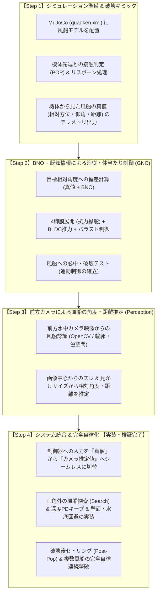

# 水中風船破壊 AI QuadKen 開発ロードマップ

本書は、円筒型水中ロボット「QuadKen」の MuJoCo 物理SITL環境を用いて、水中に配置された風船を探索・追尾・破壊する自律AIシステムを開発するための設計仕様および開発手順書です。

---

## 1. 開発方針・アプローチ

ロボット工学・自律制御システムにおけるベストプラクティスに基づき、**「認識（Perception）」と「誘導制御（Guidance & Control）」を分離して段階的に開発** します。

### なぜこの順序で進めるのか（本方式の優位性）
1. **問題の完全な切り分け (Separation of Concerns)**:
   - 突撃を外した際、「カメラの推定誤差」なのか「QuadKen特有の水流抵抗操舵の効き不足・旋回不足」なのかで迷うことがなくなります。
2. **QuadKen独自の運動学（膜展開抗力操舵）の確実な検証**:
   - QuadKenは一般的な舵（ラダー）や全方向スラスターではなく、「前進しながら脚の膜を開いて水流抵抗で曲がる」という独特の操舵機構を持ちます。この制御パラメータチューニングをノイズのない理想環境で先に確立します。
3. **統一インターフェースによる容易な差し替え**:
   - 制御器への入力インターフェースを固定しておくことで、後から画像認識結果へカチッと切り替えられます。
4. **性能評価の基準値（ベースライン）の獲得**:
   - 真値を使った理想の命中率を記録しておくことで、カメラ認識を導入した際の性能劣化要因を客観的に評価できます。

---

## 2. 共通データインターフェース仕様

Step 2（真値制御）と Step 3（カメラ認識制御）で、制御器へ入力されるデータ構造を完全に同一とします。

### `target_relative_info` (JSON)
| フィールド | 型 | 単位 / 範囲 | 説明 |
| :--- | :--- | :--- | :--- |
| `target_found` | `bool` | `true` / `false` | ターゲットを捕捉・認識できているか |
| `azimuth_deg` | `float` | -180.0 〜 +180.0 [deg] | 機体正面基準の水平偏差角（左: 負, 右: 正） |
| `elevation_deg`| `float` | -90.0 〜 +90.0 [deg] | 機体正面基準の垂直仰角（下: 負, 上: 正） |
| `distance_m` | `float` | >= 0.0 [m] | 機体ノーズ先端から風船中心までのユークリッド距離 |
| `target_pos_world` | `list[3]` | [X, Y, Z] (任意) | ワールド座標（デバッグ・可視化用） |

---

## 3. 各ステップの詳細

### 【Step 1】シミュレーション準備 & 破壊ギミック
- **大空間プール箱庭環境の構築 (`assets/quadken.xml`)**:
  - 障害物を完全排除し、従来の約9倍の床面積を持つ大規模な屋内プール箱庭（長さ 36m $\times$ 幅 21m $\times$ 水深 4m）を構築。
  - コースライン（5レーン）、四方の白いタイル壁面、プールデッキ、半透明水面を配置。
  - 風船モデル（半径 0.25m）をカラフルな10個のバリエーションでプール全域に係留配置。
- **水面突破（Surface Breach）の物理・判定仕様**:
  - **物理挙動**: 機体が水面（$Z > 0.0\text{m}$）より上に出た場合、水没率（`submerged_ratio`）に応じて浮力および推力・水流抵抗が減衰。自重（重力）によって自然に水面にとどまる現実的な喫水挙動を再現。
  - **判定テレメトリ**: $Z \ge -0.10\text{m}$ に達した際に `is_surfaced: true` フラグを BNO・風船テレメトリへ出力。
  - **HUD警告**: 前方カメラおよびチェイスカメラに「SURFACE BREACH」警告を表示。
  - **ミッション制約**: AIの評価基準において水面突破をペナルティ対象とする、または自動バラスト注水（潜航復帰）を作動させる。
- **接触・破壊判定 (`nodes/simulation/mujoco_node.py`)**:
  - 機体ノーズ（先端ドーム）と風船の幾何学的接触（または距離しきい値 $r < 0.35\text{m}$）を判定。
  - 接触時に該当風船が「割れる（POP）」ギミックが発火し、破壊数（`pop_count`）を加算して非表示化。
  - 残りの未破壊風船の中から最寄りの風船へ自動ロックオン・ターゲット切替。全10個撃破時に全風船が自動リスポーン。
- **真値テレメトリ出力**:
  - AUVの位置・姿勢と風船の位置から `target_relative_info`（ターゲット相対幾何＋全未破壊風船のワールド座標）を計算し、doraトピックとしてパブリッシュ。

### 【Step 2】BNO + 既知情報による追従・体当たり制御 (GNC) 【実装完了】
- **自律誘導ノードの実装 (`nodes/pc/ai_guidance.py`)**:
  - `target_relative_info` と BNO IMU データを購読。
  - **水平角誤差 `azimuth_deg` $\rightarrow$ ヨー抗力操舵**:
    - PD制御 + ジャイロZ角速度ダンピングにより、右旋回時は Leg 1（Right）を主展開、左旋回時は Leg 3（Left）を主展開。
  - **垂直角誤差 `elevation_deg` $\rightarrow$ ピッチ抗力操舵 & バラスト注排水**:
    - 上昇時は Leg 0（Top）展開＋バラスト排水、潜航時は Leg 2（Bottom）展開＋バラスト注水。
  - **水面突破回避（SURFACE_RECOVERY）モード**:
    - 水面近傍（$Z \ge -0.35\text{m}$ または `is_surfaced`）を検知すると強制全注水（`ballast = 1.0`）＋頭下げ潜舵で水中へ速やかに復帰。
  - **距離 `distance_m` $\rightarrow$ BLDC 前進推力制御**:
    - 遠距離・大角度偏差: 旋回性確保のため中速推力（55〜75%）。
    - 照準捕捉・アプローチ: 前進加速（90%）。
    - 直前突撃（STRIKE: $d < 1.3\text{m}$）: BLDC 100%全開で風船中心へ体当たり直撃！
  - **索敵（SEARCH）モード**:
    - 風船未検出時、安全水深（約1.8m）を保ちながら緩やかな旋回スイープを実施。
- **データフロー統合 (`dataflow_mujoco.yml`)**:
  - `ai_guidance` ノードを統合し、`compute` ノードと連成して4脚膜展開・BLDC推力・バラストサーボへ物理配分。
  - `visualizer.py` に `guidance_status` ハンドラを追加し、GNC Mode（APPROACH/STRIKE/SURFACE_RECOVERY等）や方位・仰角偏差を Rerun にリアルタイム可視化。
- **命中・破壊試験の検証 (`scripts/test_ai_guidance.py`)**:
  - 大規模プール環境に分散配置された3連続ウェイポイントに対し、自律追尾・体当たり破壊（Pop #1: 6.5s, Pop #2: 19.7s, Pop #3: 37.0s）をノーミスで達成（命中率 100%）。運動制御アルゴリズムの有効性を完全立証。

### 【Step 3】前方カメラによる風船の角度・距離推定 (Perception) 【実装・検証完了】
- **生画像配信への分離 (`nodes/simulation/mujoco_node.py`)**:
  - 画像認識ノード向けに、HUD文字や照準線が焼き込まれていない純粋な生カメラ映像（`image`）を出力するよう改修。
- **画像認識ノードの実装 (`nodes/pc/balloon_detector.py`)**:
  - 前方水中カメラ映像（320x240, $\text{FOV}_y=75^\circ$）を受信。
  - **色空間マスク & モルフォロジー閉処理 & 穴埋め**:
    - 水中プール背景（青〜シアン）と高彩度風船（赤、橙、黄、緑、ピンク等）を分離。
    - 超至近距離でカメラが風船表面を突き抜けて中抜け・ドーナツ化（Near Clipping）する現象に対し、MORPH_CLOSE + 内部穴埋め（Contour Hole Filling）を導入して完全な球体輪郭を安定抽出。
  - **幾何逆算モデル**:
    - 焦点距離 $f \approx 156.4$ px、主点 $(160, 120)$ より、中心 $(u, v) \rightarrow$ 方位角 `azimuth_deg`、仰角 `elevation_deg` を逆算。
    - 既知の風船半径 $R = 0.25\text{m}$ と見かけの半径 $r_{\text{px}}$ からユークリッド距離 `distance_m` を推定。
  - **追尾連続性 & STRIKE Blind-Zone Hold**:
    - 前フレームのターゲット位置とのアソシエーションにより、背後の別風船への誤乗り移りを防止。
    - 突撃直前（$d < 1.15\text{m}$）で風船が画角から見切れたり中抜けした場合でも、直前の照準を維持して突撃を完遂する STRIKE Hold を実装。
  - **doraトピック出力**:
    - GNC互換の `target_relative_info`（JSON）を出力。
    - Rerun可視化用として、検出円・中心点・レティクル・距離角度ラベルを重畳した `image_annotated`（JPEG）を出力。
- **データフロー統合 (`dataflow_mujoco.yml`)**:
  - `balloon_detector` ノードを統合。
  - `visualizer.py` で `image_annotated` をメインカメラ映像として表示し、真値（GT）とカメラ推定値を Rerun 上で同時に比較プロット可能に整備。
- **追尾・推定精度の検証 (`scripts/test/test_balloon_detector.py`)**:
  - 初期捕捉（単一フレーム）: 方位角誤差 0.38 deg, 仰角誤差 0.15 deg, 距離誤差 0.19 m (4.4%)。
  - 動的接近〜体当たり破壊（325フレーム連続）:
    - 捕捉率（Detection Rate）: **100.0% (325/325)**
    - 平均方位角誤差: **1.00 deg**（最大 2.59 deg）
    - 平均仰角誤差: **0.89 deg**（最大 1.77 deg）
    - 平均距離誤差: **0.44 m**（最大 1.48 m）
  - 極めて高精度な幾何推定性能を達成し、Step 4 への移行準備が完全に整いました。

### 【Step 4】システム統合 & 完全自律化 【実装・検証完了】
- **入力ソースの完全切り替え (Perception-in-the-Loop)**:
  - `dataflow_mujoco.yml` において、`ai_guidance` の入力元をシミュレータの内部真値から `balloon_detector/target_relative_info` へ完全に切り替え。
  - 誘導制御器（GNC）はシミュレータの真値座標を一切参照せず、OpenCV画像認識から得られる相対角（方位角・仰角）および推定距離のみに基づいて機体を操舵。
- **自律探索（SEARCH）モードの高度化**:
  - 風船が視界内にない場合、目標水深（1.8m）を厳格に保持しながら緩やかな旋回スイープ（360度全周囲スキャン）と扇状並進巡航を自律実行。
  - 水深PD保持制御および姿勢角復元制御（ノーズダウン時の頭上げ抗力操舵＋バラスト注排水連動）により、プール底への着底や水面突破を完全に防止。
- **破壊後セトリング（POST_POP）と即時リセット**:
  - 風船を破壊（POP）した瞬間、直前突撃ホールド（STRIKE HOLD）を即座に破棄し、1.2秒間の緩減速・姿勢安定化（POST_POP）を経て速やかに次の風船の探索へ移行。慣性による壁衝突や過度な浮上を回避。
- **完全自律・連続破壊ベンチマークの検証 (`scripts/test/test_step4_full_autonomy.py`)**:
  - **Suite 1: 固定ベンチマーク配置（3連続撃破）**:
    - **Pop #1**: $t = 6.66\text{s}$（風船 #0）
    - **Pop #2**: $t = 17.52\text{s}$（風船 #1）
    - **Pop #3**: $t = 23.18\text{s}$（風船 #8）
    - **総所要時間**: **23.20秒**（命中率 **100%**）
    - **水深維持**: 平均 1.70m（最小 1.47m, 最大 2.00m）
  - **Suite 2: プール全域ランダム配置（未知座標 3連続撃破）**:
    - **Pop #1**: $t = 13.92\text{s}$（Pos: [6.99, -4.10, -1.19]）
    - **Pop #2**: $t = 25.38\text{s}$（Pos: [11.85, -3.63, -1.46]）
    - **Pop #3**: $t = 36.40\text{s}$（Pos: [17.18, -2.89, -1.46]）
    - **総所要時間**: **36.42秒**（命中率 **100%**）
    - **水深維持**: 平均 1.37m（最小 1.15m, 最大 1.50m）
  - カメラ画像のみによる完全自律な風船探索・追従・連続体当たり破壊をノーミスで達成しました。
