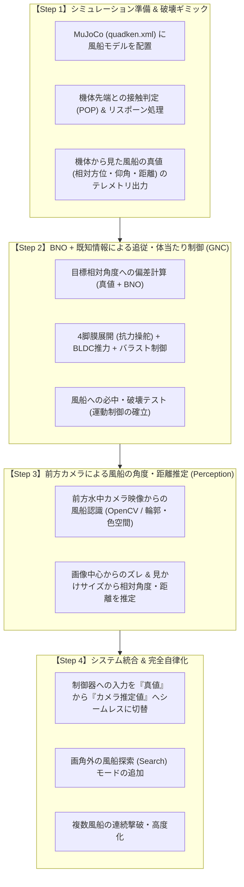

# 水中風船破壊 AI QuadKen 開発ロードマップ

本書は、円筒型水中ロボット「QuadKen」の MuJoCo 物理SITL環境を用いて、水中に配置された風船を探索・追尾・破壊する自律AIシステムを開発するための設計仕様および開発手順書です。

---

## 1. 開発方針・アプローチ

ロボット工学・自律制御システムにおけるベストプラクティスに基づき、**「認識（Perception）」と「誘導制御（Guidance & Control）」を分離して段階的に開発** します。

### なぜこの順序で進めるのか（本方式の優位性）
1. **問題の完全な切り分け (Separation of Concerns)**:
   - 突撃を外した際、「カメラの推定誤差」なのか「QuadKen特有の水流抵抗操舵の効き不足・旋回不足」なのかで迷うことがなくなります。
2. **QuadKen独自の運動学（膜展開抗力操舵）の確実な検証**:
   - QuadKenは一般的な舵（ラダー）や全方向スラスターではなく、「前進しながら脚の膜を開いて水流抵抗で曲がる」という独特の操舵機構を持ちます。この制御パラメータチューニングをノイズのない理想環境で先に確立します。
3. **統一インターフェースによる容易な差し替え**:
   - 制御器への入力インターフェースを固定しておくことで、後から画像認識結果へカチッと切り替えられます。
4. **性能評価の基準値（ベースライン）の獲得**:
   - 真値を使った理想の命中率を記録しておくことで、カメラ認識を導入した際の性能劣化要因を客観的に評価できます。

---

## 2. 共通データインターフェース仕様

Step 2（真値制御）と Step 3（カメラ認識制御）で、制御器へ入力されるデータ構造を完全に同一とします。

### `target_relative_info` (JSON)
| フィールド | 型 | 単位 / 範囲 | 説明 |
| :--- | :--- | :--- | :--- |
| `target_found` | `bool` | `true` / `false` | ターゲットを捕捉・認識できているか |
| `azimuth_deg` | `float` | -180.0 〜 +180.0 [deg] | 機体正面基準の水平偏差角（左: 負, 右: 正） |
| `elevation_deg`| `float` | -90.0 〜 +90.0 [deg] | 機体正面基準の垂直仰角（下: 負, 上: 正） |
| `distance_m` | `float` | >= 0.0 [m] | 機体ノーズ先端から風船中心までのユークリッド距離 |
| `target_pos_world` | `list[3]` | [X, Y, Z] (任意) | ワールド座標（デバッグ・可視化用） |

---

## 3. 各ステップの詳細

### 【Step 1】シミュレーション準備 & 破壊ギミック
- **大空間プール箱庭環境の構築 (`assets/quadken.xml`)**:
  - 障害物を完全排除し、従来の約9倍の床面積を持つ大規模な屋内プール箱庭（長さ 36m $\times$ 幅 21m $\times$ 水深 4m）を構築。
  - コースライン（5レーン）、四方の白いタイル壁面、プールデッキ、半透明水面を配置。
  - 風船モデル（半径 0.25m）を水中に配置。
- **水面突破（Surface Breach）の物理・判定仕様**:
  - **物理挙動**: 機体が水面（$Z > 0.0\text{m}$）より上に出た場合、水没率（`submerged_ratio`）に応じて浮力および推力・水流抵抗が減衰。自重（重力）によって自然に水面にとどまる現実的な喫水挙動を再現。
  - **判定テレメトリ**: $Z \ge -0.10\text{m}$ に達した際に `is_surfaced: true` フラグを BNO・風船テレメトリへ出力。
  - **HUD警告**: 前方カメラおよびチェイスカメラに「SURFACE BREACH」警告を表示。
  - **ミッション制約**: AIの評価基準において水面突破をペナルティ対象とする、または自動バラスト注水（潜航復帰）を作動させる。
- **接触・破壊判定 (`nodes/simulation/mujoco_node.py`)**:
  - 機体ノーズ（先端ドーム）と風船の幾何学的接触（または距離しきい値 $r < 0.35\text{m}$）を判定。
  - 接触時に「割れる（POP）」ギミックが発火し、破壊数（`pop_count`）を加算。
  - 36m $\times$ 21m のプール全域に分散配置された次候補ウェイポイントへ自動リスポーン。
- **真値テレメトリ出力**:
  - AUVの位置・姿勢と風船の位置から `target_relative_info` を計算し、doraトピックとしてパブリッシュ。

### 【Step 2】BNO + 既知情報による追従・体当たり制御 (GNC)
- **自律誘導ノードの作成 (`nodes/pc/ai_guidance.py`)**:
  - `target_relative_info` と BNO IMU データを購読。
  - 水平角誤差 `azimuth_deg` $\rightarrow$ 左右の脚（Leg 1 / Leg 3）の差動膜展開角へ変換（ヨー抗力操舵）。
  - 垂直角誤差 `elevation_deg` $\rightarrow$ 上下の脚（Leg 0 / Leg 2）の膜展開角およびバラスト注水・排水へ変換（ピッチ・深度制御）。
  - 距離 `distance_m` $\rightarrow$ BLDC 前進推力（接近〜突撃全速）。
- **命中試験**:
  - 固定配置された風船に確実に直撃して破壊できることを検証。

### 【Step 3】前方カメラによる風船の角度・距離推定 (Perception)
- **画像認識ノードの作成 (`nodes/pc/balloon_detector.py`)**:
  - 前方水中カメラ映像（`image`）を受信。
  - HSV色空間による風船マスク抽出、または幾何形状（ハフ円・輪郭フィッティング）による中心 $(u, v)$ の検出。
  - カメラの内部パラメータ（画角 FOV=75度, 解像度 320x240）から `azimuth_deg`, `elevation_deg` を逆算。
  - 検出された風船の見かけ半径/輪郭ピクセル面積から `distance_m` を推定。
  - `target_relative_info` フォーマットで出力。

### 【Step 4】システム統合 & 完全自律化
- **入力ソースの切替**:
  - `dataflow_mujoco.yml` で、`ai_guidance` の入力元をシミュレータの真値から `balloon_detector` へ切り替え。
- **探索（Search）モードの実装**:
  - 風船が視野内にない場合（`target_found == false`）、ゆっくり旋回して全周囲をスキャン。
  - 発見次第、追従・突撃（Approach / Strike）シーケンスへ移行。
- **ランダムリスポーンへの対応**:
  - 破壊されるたびに異なる水深・位置に現れる風船を次々と破壊する自律ミッションの完遂。
